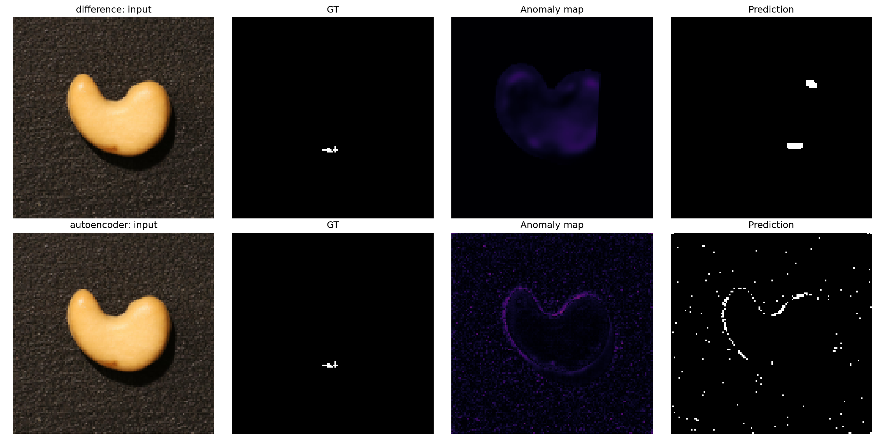

# Few-Shot Industrial Visual Anomaly Detection

Introduction to Computer Vision 项目。当前完成的是 **Part 1 的 VisA 腰果（cashew）教学实验**：正常模板差分与紧凑卷积自编码器。Part 2 AnomalyDINO/AnomalyCLIP、Part 3 改进与课程要求的六类最终实验尚未完成。

## 代码结构

```text
src/intro_to_cv/
├── baselines/
│   ├── template/       # ECC、前景掩膜、差分/SSIM、校准和预测
│   └── autoencoder/    # 模型、正常训练、重建、校准和评价
├── common/             # 读图/缩放、VisA划分/GT、评分、阈值、形态学与指标
└── experiments/        # 两条基线的统一对照
artifacts/part1/         # 小模型权重、正常训练/校准清单、阈值（可复现）
reports/part1/           # 最终指标、逐图预测、定位图、训练曲线与报告笔记
outputs/                # 新实验临时输出，不纳入Git
```

旧的 `part1_*.py` 已迁移到上述模块。现在优先使用 `uv run intro-to-cv ...`，详细参数可用 `--help` 查看。

## 环境与数据

需要 Python 3.12+ 和 [uv](https://docs.astral.sh/uv/)。在仓库根目录运行：

```bash
uv sync --locked
uv run intro-to-cv --help
```

PyTorch 使用专用CPU索引；其余依赖来自PyPI。依赖由 `pyproject.toml` 和 `uv.lock` 固定，无需手动使用pip。

VisA原始数据不提交到Git。已有数据应位于 `data/raw/visa/`，其中含 `cashew/` 和 `split_csv/1cls.csv`。下载和解压：

```bash
mkdir -p data/raw/visa
curl -L --fail --retry 3 -o data/raw/VisA_20220922.tar \
  https://amazon-visual-anomaly.s3.us-west-2.amazonaws.com/VisA_20220922.tar
tar -xf data/raw/VisA_20220922.tar -C data/raw/visa
```

使用官方 `split_csv/1cls.csv`，不根据文件编号自行划分训练/测试。正常图真实掩膜为全零；异常原始掩膜所有非零标签转为异常。

## 一条命令复现报告中的统一对照

仓库包含约260KB的已训练CPU模型、完整训练清单和40张正常校准图清单，无需重新训练即可评价：

```bash
uv run intro-to-cv compare \
  --checkpoint artifacts/part1/autoencoder/model.pt \
  --normal-calibration artifacts/part1/normal_calibration/threshold.json \
  --output outputs/part1/comparison
```

这条命令为两种方法重新进行正常校准，然后测试官方cashew完整150张图，保存指标、逐图分数、四联对照、光照探针和实验协议。不会修改已保存的 `reports/` 快照。

## 分别运行两条基线

### 正常模板差分

先用正常训练图选择模板和独立校准图，再预测。这里单独CLI保留原尺寸教学设置，与报告中的统一128设置不同，不要混用结果表。

```bash
uv run intro-to-cv template calibrate --num-calibration 40 --seed 0 \
  --target-fpr 0.05 --pixel-fpr 0.005 \
  --output outputs/part1/template/calibration
uv run intro-to-cv template predict \
  --calibration outputs/part1/template/calibration/threshold.json \
  --test data/raw/visa/cashew/Data/Images/Anomaly/001.JPG \
  --output outputs/part1/template/prediction
```

查看配准、绝对差、平滑差与SSIM的教学对照：

```bash
uv run intro-to-cv template-maps \
  --reference data/raw/visa/cashew/Data/Images/Normal/185.JPG \
  --test data/raw/visa/cashew/Data/Images/Anomaly/001.JPG \
  --mask data/raw/visa/cashew/Data/Masks/Anomaly/001.png \
  --foreground --output outputs/part1/template/maps
```

`--mask` 仅展示真实标注，不参与打分或校准。`template-eval` 可批量统计原尺寸教学设置的图像指标；默认完整测试集，`--exclude-exploration` 可显式排除异常000/001。

### 紧凑卷积自编码器

407张正常训练图与40张校准图互斥。重训使用固定10轮、RGB MSE、128×128直接缩放，不根据异常测试结果选epoch。

```bash
uv run intro-to-cv autoencoder train \
  --normal-calibration artifacts/part1/normal_calibration/threshold.json \
  --epochs 10 --size 128 --batch-size 16 --threads 4 \
  --output outputs/part1/autoencoder
uv run intro-to-cv autoencoder reconstruct \
  --checkpoint outputs/part1/autoencoder/model.pt \
  --test data/raw/visa/cashew/Data/Images/Anomaly/001.JPG \
  --output outputs/part1/autoencoder/reconstruction
uv run intro-to-cv autoencoder-eval calibrate \
  --checkpoint outputs/part1/autoencoder/model.pt \
  --output outputs/part1/autoencoder/calibration
uv run intro-to-cv autoencoder-eval evaluate \
  --calibration outputs/part1/autoencoder/calibration/threshold.json \
  --output outputs/part1/autoencoder/evaluation
```

AE单独评价与统一对照的AE部分使用同样的128全图重建误差。新权重必须重新校准，不能沿用模板差分阈值。

## 当前结果

完整cashew测试集：50张正常、100张异常；两方法相同128×128输入、40张正常校准图与全图最高1%差值均值评分。数据预算不同：差分1模板，自编码器407张正常训练图。

|方法|图像AUROC|图像AP|FPR|FNR|像素AUROC|像素AP|AUPRO|
|---|---:|---:|---:|---:|---:|---:|---:|
|模板差分|0.8278|0.8892|0.1000|0.5700|0.8851|0.4489|0.7261|
|自编码器|0.9512|0.9636|0.0800|0.0800|0.5831|0.0169|0.4039|

图像检测较好不代表定位较好。小模型重建较模糊，轮廓和正常纹理也会产生误差；模板差分受个体形状、光照和背景变化影响。



## 实验边界与报告材料

- 128×128是直接缩放，改变宽高比且可能丢失细小缺陷；GT采用最近邻缩放。
- 差分内部使用ECC和亮前景掩膜；AE内部使用RGB重建。统一的是输入尺寸、测试清单、校准集、评分和评价，不是训练数据预算或全部方法内部处理。
- 异常000/001曾用于教学观察，000曾影响前景范围设计；完整测试包含它们，成绩属于开发阶段结果。
- 所有报警阈值只由正常校准图确定。图像目标FPR5%、像素超阈比例0.5%，不保证测试误报率相同。
- 像素指标包含正常图和全部背景；差分掩膜外/变换未覆盖处设零分数，不仅评价前景。
- AUPRO按8连通GT区域等权，FPR积分上限0.3后归一化。评价的是连续分数，形态学只作用于二值展示预测。
- ECC在两张低分辨率异常测试图上失败；统一对照采用已记录的未配准差分回退，不删除失败样本。单图CLI仍可能返回UNCERTAIN。
- 固定0.8倍亮度探针是合成正常扰动，不是新的真实跨域数据集。
- 计时仅覆盖本机推理/打分，不含文件读取；未完成课程全部效率测量与六类实验。

详细素材目录与展示建议见 [reports/part1/README.md](reports/part1/README.md)，方法解释见 [docs/part1_methods.md](docs/part1_methods.md)。

## 验证

```bash
uv run python -m unittest discover -s tests -v
```

检查正常训练/校准互斥、模型输出、评分规则和区域等权AUPRO。整理代码后，已重新运行完整150图对照，指标与原结果一致（计时可能变化）。

## 引用

VisA: Zou et al., *SPot-the-Difference Self-Supervised Pre-training for Anomaly Detection and Segmentation*, ECCV 2022. [官方数据与划分](https://github.com/amazon-science/spot-diff)。数据许可CC BY 4.0；本仓库仅保留由VisA生成的少量标注/预测展示图，并按上述来源署名，不包含完整数据集。

实现依赖 [OpenCV](https://opencv.org/)、[PyTorch](https://pytorch.org/)、[scikit-image](https://scikit-image.org/) 和 [scikit-learn](https://scikit-learn.org/)。Part 2 将使用课程指定的 [AnomalyDINO](https://github.com/dammsi/AnomalyDINO) 与 [AnomalyCLIP](https://github.com/zqhang/AnomalyCLIP)。
